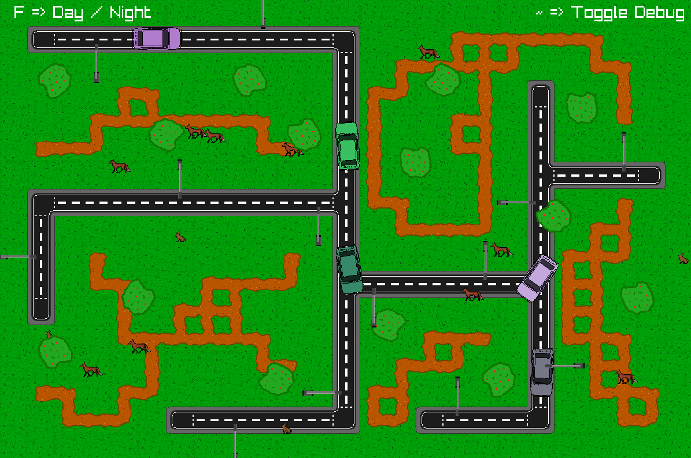
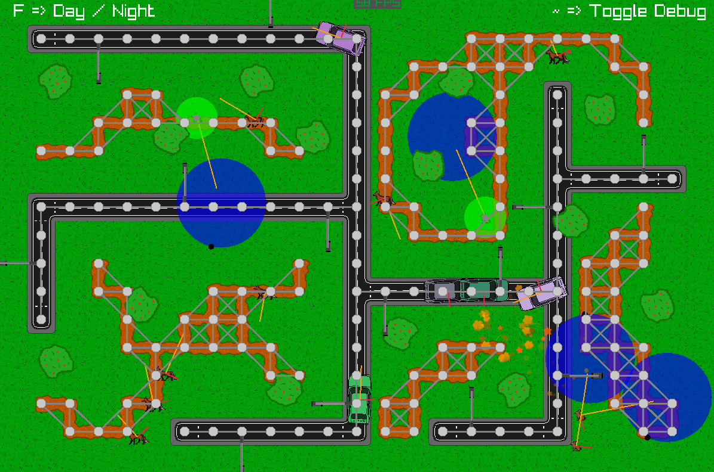
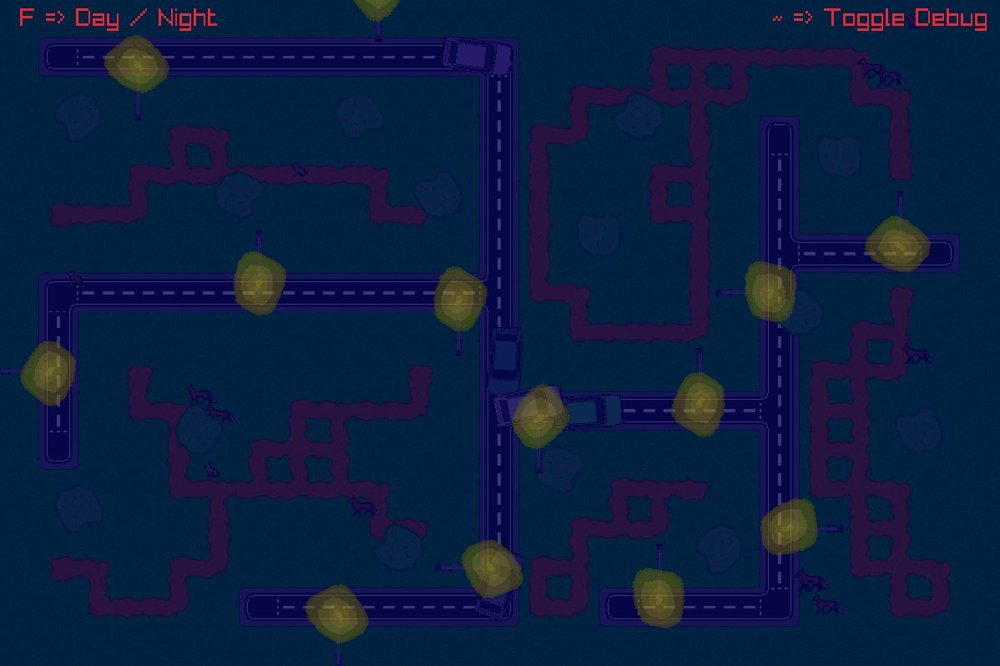

[HOME](../README.md)
|
[DEMO DOWNLOAD](https://github.com/E-Dawkins/ProjectDemos/releases/tag/AI-Showcase-Demo-v1.0)
# AI Showcase

## **Simple demonstration of the Dijkstra's and A-Star AI path finding algorithms, integrated with multiple steering behaviors. Made for the Academy of Interactive Entertainment.**

The AI demo consists of 3 different AI; foxes, rabbits, and cars. The foxes chase the rabbits when they are close enough, the rabbits run away from the foxes if they get too close and the cars path find to a random point on the road. The foxes and rabbits respawn after a delay if they are hit by a car.

 

The foxes use the Dijkstra pathfinding algorithm on the dirt paths, and then switch to chasing the rabbits with a target behavior. The rabbits use a wander behavior until they are too close to a fox, then switch to a flee behavior. The cars use the A* pathfinding algorithm, because they only path find they require the faster algorithm. Whereas the foxes path find and chase the rabbits so they use the slower algorithm.

### **Made With**
* C++

---

## Demo (without debug)

---

## Demo (with debug)

---

## 'Night' Mode
