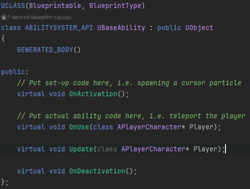

[HOME](../README.md)
|
[DEMO DOWNLOAD](https://github.com/E-Dawkins/ProjectDemos/releases/tag/Ability-System-Demo-v1.0)
# Ability System

## **A recreation of the ability system in the Dishonored franchise. Made as a personal side project.**

### **Made With**
* C++
* Unreal Engine

---

[comment]: <> (Add link for each new devlog)

### [Devlog #0 The Start of Something New](#devlog-0-the-start-of-something-new)

---

## Devlog #0 The Start of Something New

    The first step to re-creating the ability system from Dishonored was to make a simple player controller, and as it turns out Unreal was definitely the right choice for the job.

    The base ACharacter class had built-in functions for making simple character movement, complete with jumping, crouching and even to look around with locking when looking directly up or down.

    Once I had basic player movement set up, I started looking into the best way to make the ability system. It was hard at first to decide what parent class the BaseAbility class should inherit from, as I specifically wanted an equivalent to Unity's Scriptable Object.

 
 
 

    After many tried and failed attempts at parent classes that were empty, but could also be referenced from the player class, I ended up making the BaseAbility class inherit straight from UObject. Having this class be a UObject meant it could be both a blueprint and not include any unnecessary functionalities, i.e. Tick, Collision, etc.

    In the future the virtual functions will be used as follows; OnActivation when the player selects from the ability wheel, OnUse when the ability is used, Update every frame the player holds down RMB, and OnDeactivation whenever the player selects another ability.

 
 

    The BaseAbility class was now completely empty and blueprint-able, this combined with the player controller from earlier created a solid foundation on which to build upon.

---