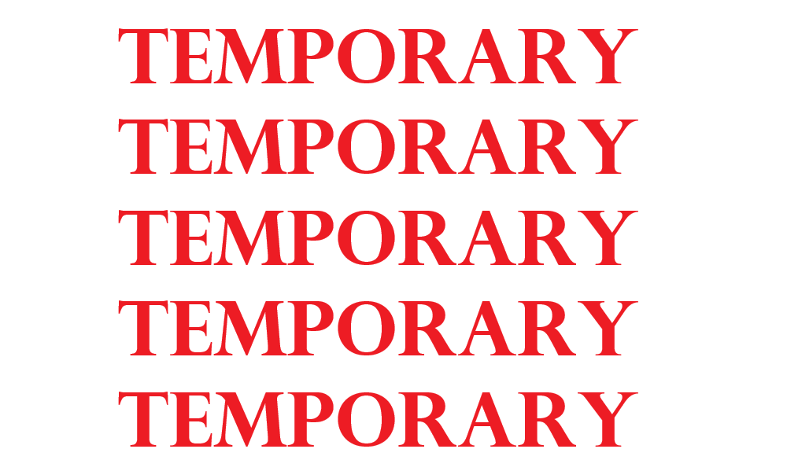
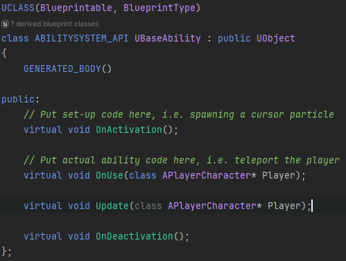
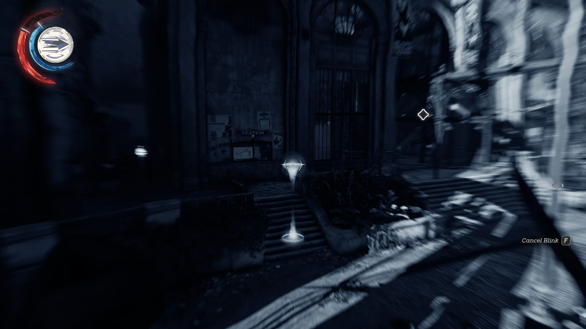
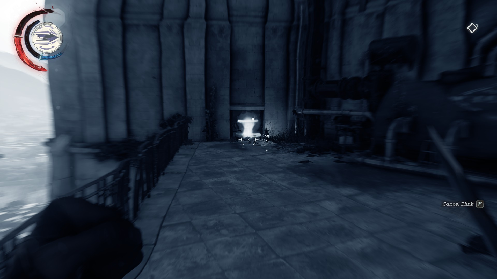
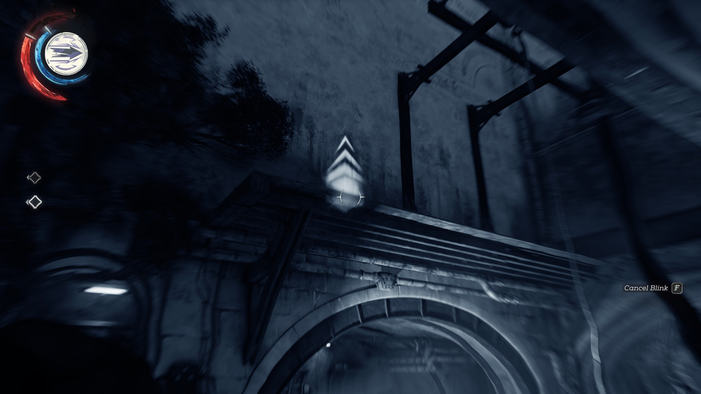
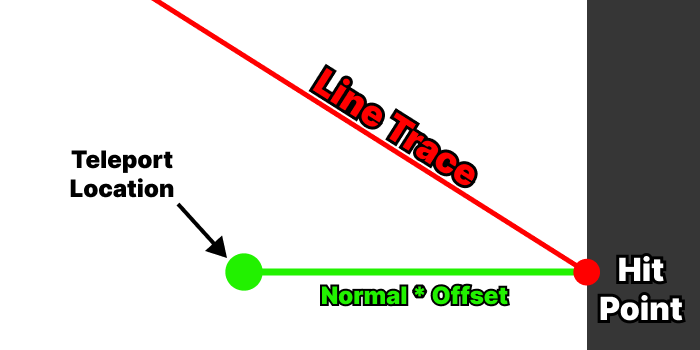
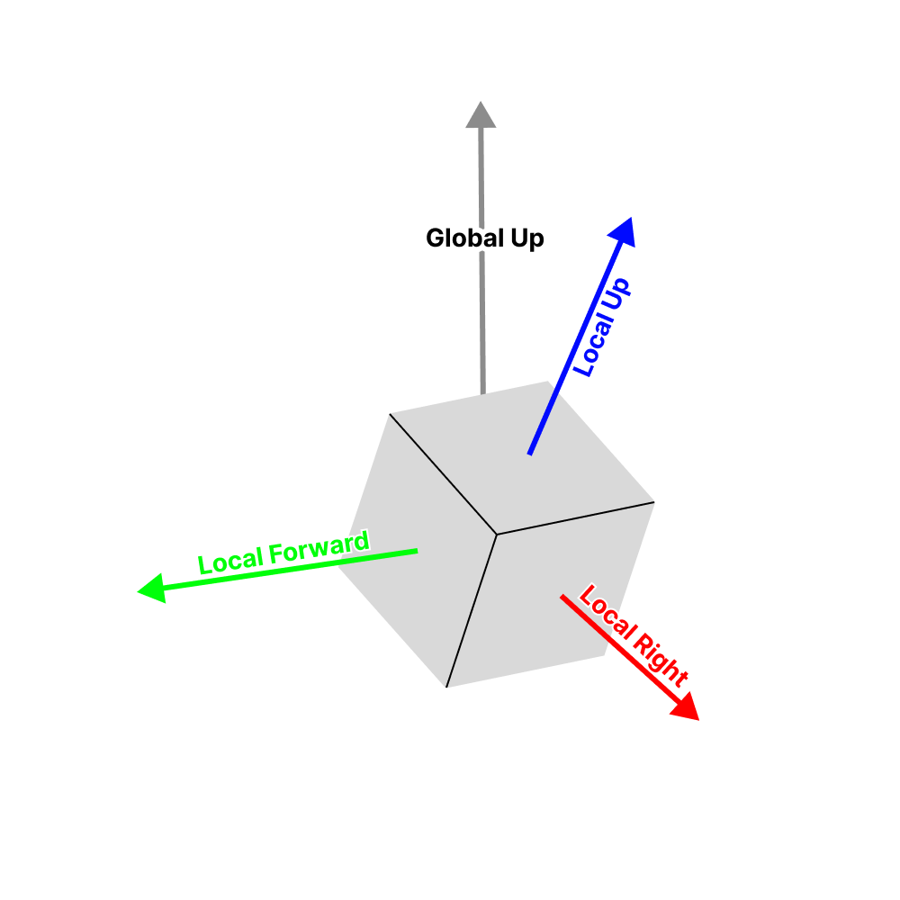
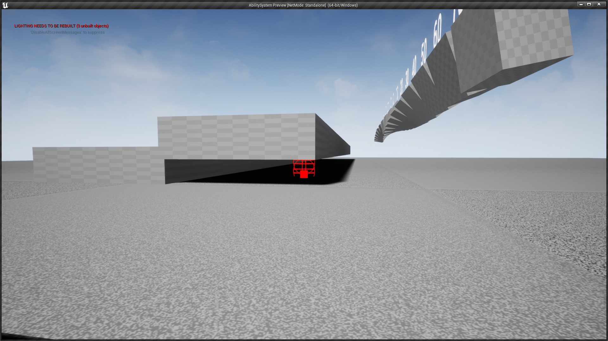
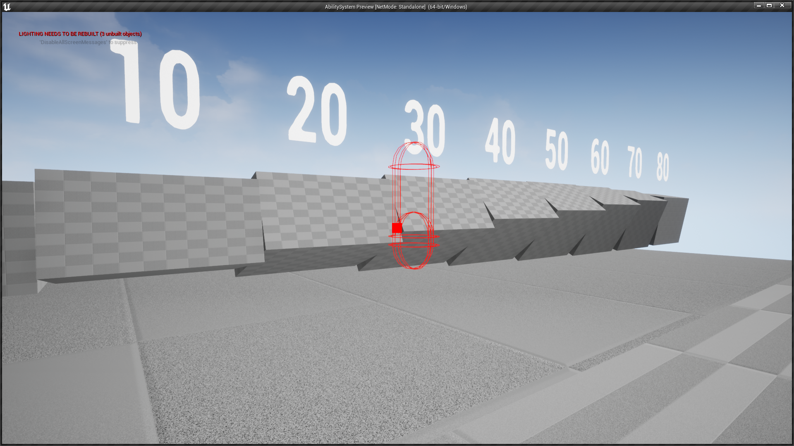

[HOME](../README.md)
|
[DEMO DOWNLOAD](https://github.com/E-Dawkins/ProjectDemos/releases/tag/Ability-System-Demo-v1.0)
# Ability System

## **A recreation of the ability system in the Dishonored franchise. Made as a personal side project.**

### **Made With**
* C++
* Unreal Engine

---

[comment]: <> (Add link for each new devlog)

### [Devlog #0 The Start of Something New](#devlog-0-the-start-of-something-new-1)
### [Devlog #1 "Blink" and You'll Miss it](#devlog-1-blink-and-youll-miss-it-1)

---

## Devlog #0 The Start of Something New

[comment]: <> (TODO - swap for SimpleController.mp4)

    The first step to re-creating the ability system from Dishonored was to make a simple player controller, and as it turns out Unreal was definitely the right choice for the job.

    The base ACharacter class had built-in functions for making simple character movement, complete with jumping, crouching and even to look around with locking when looking directly up or down.

    Once I had basic player movement set up, I started looking into the best way to make the ability system. It was hard at first to decide what parent class the BaseAbility class should inherit from, as I specifically wanted an equivalent to Unity's Scriptable Object.

 

    After many tried and failed attempts at parent classes that were empty, but could also be referenced from the player class, I ended up making the BaseAbility class inherit straight from UObject. Having this class be a UObject meant it could be both a blueprint and not include any unnecessary functionalities, i.e. Tick, Collision, etc.

    In the future the virtual functions will be used as follows; OnActivation when the player selects from the ability wheel, OnUse when the ability is used, Update every frame the player holds down RMB, and OnDeactivation whenever the player selects another ability.

 
 

    The BaseAbility class was now completely empty and blueprint-able, this combined with the player controller from earlier created a solid foundation on which to build upon.

---

## Devlog #1 "Blink" and You'll Miss it

    The first ability I wanted to re-create was the iconic blink ability, a seemingly simple teleport mechanic, but oh-boy was it complex! To start with here are a few screenshots of the ability in action:

    From these screenshots you can see that the Blink ability has many edge cases. The normal use case (top-left) where the player is not aiming at a surface, and they teleport into the air. The player is aiming at a surface but there is only room to crouch (top-right), they should be teleported there but crouched. And when the player aims at an edge (bottom-left) they should teleport on top of the edge.

 
 
 

    Let's start with the easiest implementation of a teleport mechanic, where you line trace from the players' viewpoint and in the direction that they are looking. If the line trace doesn't hit a surface, easy just teleport them to the end of the line trace, but if the line trace does hit a surface, teleport them to the impact point offset by the impact normal.

[comment]: <> (TODO - swap for BasicTeleport.mp4)

    Once I had the basic "lazy" teleport working, I started researching the best way to check for the mantle-able edge. But after researching countless other implementations of the Blink mechanic, I found that none of them were truly robust, i.e. one implementation added a force upwards so the player always launched a bit higher than where they were aiming.

    After many failed attempts at implementing the edge-mantle, I decided to break the problem down into two simple questions. What is a wall? How for are we aiming from the top of a wall?

 
 

    The former of these questions was actually quite simple to answer, just check the dot product between the impact normal and the global up vector. How does this help us? Well, the dot product of two vectors tells us how aligned they are, so using this knowledge we can determine that a dot product of ~0 means it is a wall. As for the latter, I came up with what I think is a robust solution, a recursive sphere trace. So, starting from the impact point I sphere trace using the up vector of this normal (more on that later), and because a sphere trace in Unreal only hits an object a single time I recall the sphere trace but offset by an amount and add all hits to an out array, the last hit in this array is the top edge and the distance to the top can be calculated.

    To determine the up vector from the normal, we first consider the normal to be the forward vector of an arbitrary local axis, then getting the cross product of the normal and the global up vector we obtain the local right vector. Then doing one more cross between the original forward vector (normal) and the local right vector we get back the local up vector. Then using this up vector we feed it into the recursive sphere trace, which was much more reliable than just using the global up vector. In the video below, the purple line is the local up vector and the spheres are the recursive trace, turning green when the player can "mantle".

 

[comment]: <> (TODO - swap for MantleSphereTrace.mp4)

    

    After combining all these methods and implementing a comprehensive head check that takes into account the player crouching, you are left with a rather robust Blink system. There are of course some very specific edge-cases that I feel aren't worth taking the time to correct, but I'm sure it is possible with some extra checks. Below are the edge-cases that I have found.

<table border="0">
 <tr>
    <td>
        

            Aiming too far under a platform doesn't let you Blink, and what it should do underneath, happens rare enough.
        

    </td>
    <td>
        

            Aiming at a very specific point next to another edge, fails all head checks, including crouch checks, happens in very specific circumstances.
        

    </td>
 </tr>
 <tr>
    <td>
        
    </td>
    <td>
        
    </td>
 </tr>
 <tr>
    <td>
        
    </td>
 </tr>
</table>

    And after adding a few cursors, I'm only a programmer please don't judge 🙏, it now looks pretty good, complete with everything I set out to do; simple teleport, mantle teleport and teleport-into-crouch. Overall, I am really happy with how it turned out, it was an eye-opening experience into how a "simple" mechanic can actually be quite complex.

[comment]: <> (TODO - swap for BlinkGameplay.mp4)

    

---
