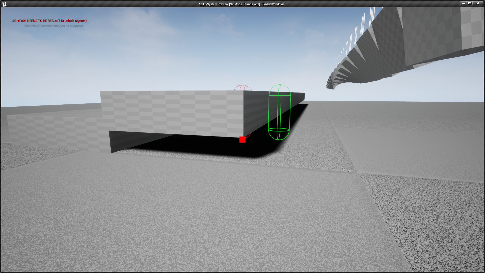

[HOME](../README.md)
|
[DEMO DOWNLOAD](https://github.com/E-Dawkins/ProjectDemos/releases/tag/Ability-System-Demo-v1.0)
# Ability System

## **A recreation of the ability system in the Dishonored franchise. Made as a personal side project.**

### **Made With**
* C++
* Unreal Engine

---

[comment]: <> (Add link for each new devlog)

### [Devlog #0 The Start of Something New](#devlog-0-the-start-of-something-new-1)
### [Devlog #1 "Blink" and You'll Miss it](#devlog-1-blink-and-youll-miss-it-1)
### [Devlog #2 "Blink"-ing is Believing](#devlog-2-blink-ing-is-believing-1)
### [Devlog #3 That's a "Far Reach" from Ordinary](#devlog-3-thats-a-far-reach-from-ordinary-1)
### [Devlog #4 "Bend Time", Not Your Spine](#devlog-4-bend-time-not-your-spine-1)
### [Devlog #5 Dynamic Weapon Wheel](#devlog-5-dynamic-weapon-wheel-1)
### [Devlog #6 "Devouring Swarm", Ratatouille Took a Turn](#devlog-6-devouring-swarm-ratatouille-took-a-turn-1)
### [Devlog #7 Fixing "Bend Time", and Other Improvements](#devlog-7-fixing-bend-time-and-other-improvements-1)

---

## Devlog #0 The Start of Something New

https://github.com/E-Dawkins/ProjectDemos/assets/98858908/e267061e-f780-48da-95f7-08cb1ce3f620

    The first step to re-creating the ability system from Dishonored was to make a simple player controller, and as it turns out Unreal was definitely the right choice for the job.

    The base ACharacter class had built-in functions for making simple character movement, complete with jumping, crouching and even to look around with locking when looking directly up or down.

    Once I had basic player movement set up, I started looking into the best way to make the ability system. It was hard at first to decide what parent class the BaseAbility class should inherit from, as I specifically wanted an equivalent to Unity's Scriptable Object.

 

    After many tried and failed attempts at parent classes that were empty, but could also be referenced from the player class, I ended up making the BaseAbility class inherit straight from UObject. Having this class be a UObject meant it could be both a blueprint and not include any unnecessary functionalities, i.e. Tick, Collision, etc.

    In the future the virtual functions will be used as follows; OnActivation when the player selects from the ability wheel, OnUse when the ability is used, Update every frame the player holds down RMB, and OnDeactivation whenever the player selects another ability.

 
 

    The BaseAbility class was now completely empty and blueprint-able, this combined with the player controller from earlier created a solid foundation on which to build upon.

---

## Devlog #1 "Blink" and You'll Miss it

    The first ability I wanted to re-create was the iconic blink ability, a seemingly simple teleport mechanic, but oh-boy was it complex! To start with here are a few screenshots of the ability in action:

    From these screenshots you can see that the Blink ability has many edge cases. The normal use case (top-left) where the player is not aiming at a surface, and they teleport into the air. The player is aiming at a surface but there is only room to crouch (top-right), they should be teleported there but crouched. And when the player aims at an edge (bottom-left) they should teleport on top of the edge.

 
 
 

    Let's start with the easiest implementation of a teleport mechanic, where you line trace from the players' viewpoint and in the direction that they are looking. If the line trace doesn't hit a surface, easy just teleport them to the end of the line trace, but if the line trace does hit a surface, teleport them to the impact point offset by the impact normal.

 

https://github.com/E-Dawkins/ProjectDemos/assets/98858908/ddd99415-9438-4ccb-bdc2-2e4bdb911e08

    Once I had the basic "lazy" teleport working, I started researching the best way to check for the mantle-able edge. But after researching countless other implementations of the Blink mechanic, I found that none of them were truly robust, i.e. one implementation added a force upwards so the player always launched a bit higher than where they were aiming.

    After many failed attempts at implementing the edge-mantle, I decided to break the problem down into two simple questions. What is a wall? How for are we aiming from the top of a wall?

 
 

    The former of these questions was actually quite simple to answer, just check the dot product between the impact normal and the global up vector. How does this help us? Well, the dot product of two vectors tells us how aligned they are, so using this knowledge we can determine that a dot product of ~0 means it is a wall. As for the latter, I came up with what I think is a robust solution, a recursive sphere trace. So, starting from the impact point I sphere trace using the up vector of this normal (more on that later), and because a sphere trace in Unreal only hits an object a single time I recall the sphere trace but offset by an amount and add all hits to an out array, the last hit in this array is the top edge and the distance to the top can be calculated.

    To determine the up vector from the normal, we first consider the normal to be the forward vector of an arbitrary local axis, then getting the cross product of the normal and the global up vector we obtain the local right vector. Then doing one more cross between the original forward vector (normal) and the local right vector we get back the local up vector. Then using this up vector we feed it into the recursive sphere trace, which was much more reliable than just using the global up vector. In the video below, the purple line is the local up vector and the spheres are the recursive trace, turning green when the player can "mantle".

 

https://github.com/E-Dawkins/ProjectDemos/assets/98858908/ae76b97a-f472-4087-baf7-25d67368490c

    After combining all these methods and implementing a comprehensive head check that takes into account the player crouching, you are left with a rather robust Blink system. There are of course some very specific edge-cases that I feel aren't worth taking the time to correct, but I'm sure it is possible with some extra checks. Below are the edge-cases that I have found.

<table border="0">
 <tr>
    <td>
        

            Aiming too far under a platform doesn't let you Blink, and what it should do underneath, happens rare enough.
        

    </td>
    <td>
        

            Aiming at a very specific point next to another edge, fails all head checks, including crouch checks, happens in very specific circumstances.
        

    </td>
 </tr>
 <tr>
    <td>
        
    </td>
    <td>
        
    </td>
 </tr>
 <tr>
    <td>
        
    </td>
 </tr>
</table>

    And after adding a few cursors, I'm only a programmer please don't judge 🙏, it now looks pretty good, complete with everything I set out to do; simple teleport, mantle teleport and teleport-into-crouch. Overall, I am really happy with how it turned out, it was an eye-opening experience into how a "simple" mechanic can actually be quite complex.

https://github.com/E-Dawkins/ProjectDemos/assets/98858908/6e2465e1-0f0e-4095-ae1e-4393b173e22a

---

## Devlog #2 "Blink"-ing is Believing

    Shortly after writing the last devlog, the edge cases were really bugging me, so I took a step back and realized what the real issue was. Let's think about it for a second, the reason why you couldn't teleport under specific circumstances is because all the head checks failed, right? And so I looked into it, and the teleport location was being set regardless of if the player could actually teleport or not. Adding in a quick check before setting the teleport / cursor locations fixed it! Now the system is 100% reliable and works under every circumstance that I tested, now I'm sure there are some very obscure fail-cases but in normal gameplay how often would they happen? Good enough for me.

<table border="0">
 <tr>
    <td>
        

            Aiming far under a platform, now leaves the teleport location in the last spot where it last passed all checks.
        

    </td>
    <td>
        

            Aiming at a corner now also leaves the teleport location in the last spot where it passed all checks.
        

    </td>
 </tr>
 <tr>
    <td>
        
    </td>
    <td>
        
    </td>
 </tr>
</table>

---

## Devlog #3 That's a "Far Reach" from Ordinary

    The next ability on the list was very similar to the last, "Far Reach", it's essentially a teleport ability except instead of instantly teleporting to the target location you quickly rush towards it. This at first was difficult to think about, because how do you reliably rush towards an arbitrary point?

 

    My solution was to re-create the Unity function, 'Move Towards', which as the name would suggest moves a value towards another value. The advantage of using this over something like a linear interpolation, is that it doesn't require the start point or the alpha/t value that other interpolation functions do, instead taking in the current, target and max delta.

    Once I had the Move Towards function implemented, it was time to work on resolving the other issues of gravity and velocity carry-over. The gravity problem was solved by setting the players' gravity scale to 0 at the start of the rush and back to 1 at the end of the rush. As for the velocity carry-over, I just store the velocity before the rush, set the players' velocity to 0, and then back to stored velocity after the rush. Here's a short demo of the ability in action:

https://github.com/E-Dawkins/ProjectDemos/assets/98858908/bec10ee4-0b97-4a99-9a4e-1e8b6706bffa

---

## Devlog #4 "Bend Time", Not Your Spine

    'Time' for something a little less challenging, more of a refresher if you will. "Bend Time" does as the name suggests, you can slow time and, with an ability upgrade, stop time as well, but you still move at normal speed. This was an interesting ability to implement, because how does one stop everything but the player?

https://github.com/E-Dawkins/ProjectDemos/assets/98858908/49e6d9dc-92fd-4e9f-b6c1-d27fa164f9a3

    I started off by finding a way to slow everything but the player, there are really only two ways to go about a problem like this. Either implement a component every physics body requires, to change their individual custom time dilation (yes, that exists in Unreal), but this approach requires a lot of set-up and I wanted my system to essentially be plug'n'play, with minimal set-up. The other approach was to change the global time dilation, and simply speed up the player so they appear to be moving normally.

 

    I opted for the second approach, as it was actually a relatively simple formula to work out how fast to make the player, or rather what time dilation the player required. But there were two problems with this approach, the formula 1/Global Dilation worked but what if you wanted to stop everything (i.e. Global Dilation = 0), then the result would be division by zero which is a big no-no. And the second being, what to do if time is stopped but you collide with a physics object?

https://github.com/E-Dawkins/ProjectDemos/assets/98858908/65cfccb9-7852-46e3-b359-7691c7951642

    The division-by-zero problem was relatively easy to solve, instead of setting global dilation to 0 set it to something very small like 0.0001, which would appear to stop time but in reality everything is moving extremely slowly. The collision problem was a bit harder to solve, as no matter what I tried physics objects would get accelerated to an extreme speed when time reverted back to normal. I ended up freezing the physics objects position and stopping physics simulation when the player got close to the object.

 

    After many iterations of this ability, and a lot of collision testing, the ability seems to be about 95% reliable, which could be seen as negative, but I believe that this is good enough for my system. Because if I was going to be making this into a full-fledged game, I would have gone the other route with every actor having some sort of "TimeBendable" component that would be responsible for slowing / stopping each actor. See a demo video below:

https://github.com/E-Dawkins/ProjectDemos/assets/98858908/f9e6206e-9cea-49ac-89e9-2856f584912f

---

## Devlog #5 Dynamic Weapon Wheel

<table border="0">
 <tr>
    <td>
        

            Next on the list was to make a weapon wheel, but not just any weapon wheel, a dynamic weapon wheel. By dynamic I mean distributing the wheel icons evenly around the wheel, at run-time. The maths behind a dynamic weapon wheel is relatively simple, just rotate the starting position of item 0 around the wheel center by some amount. The hard part was figuring out how to create the icons at run-time and how to store the item data.
        

    </td>
     <td width="30%">
        
    </td>
 </tr>
 <tr>
     <td>
        

            The creation of the wheel icons had me torn between using a button widget, or an image widget. On the one hand, the button widget had hovering built in but from testing having to hover over exactly where the icon was made the wheel finicky to use. Whereas the image approach was easier to manage, but with the obvious disadvantage of not having any hovering capabilities. After figuring out the maths to determine which icon is being pointed at, I decided to use the image widget for each wheel item and manually handle the icon switching between normal and selected.
        

    </td>
    <td width="30%">
        
    </td>
 </tr>
</table>

 

    After getting the creation of the items down, I had to decide which base class to use for storing the wheel item data. Eventually after exploring multiple base classes, the best option was to use the lowest level object possible, the UObject parent class. With this and a WeaponWheel class, inherited from UUserWidget, it was rather trivial to dynamically add the items at run-time and to manually handle the item hovering. All of this combined plus a not-the-best recreation of the icons from Dishonored 2 made for a pretty robust and customizable dynamic weapon wheel.

### **3 Items**
https://github.com/E-Dawkins/ProjectDemos/assets/98858908/f3b88c3f-15ce-4200-ba07-1aeb9d610067

 

### **9 Items**
https://github.com/E-Dawkins/ProjectDemos/assets/98858908/3631ea7a-a148-406b-b970-9c8a9ac3a3d6

 

---

## Devlog #6 "Devouring Swarm", Ratatouille Took a Turn

    After finishing the weapon wheel I was stuck on what ability to re-create next. I wanted something challenging but not too hard to implement, but there was one problem, almost all the other abilities required an enemy to use. So, it was finally time to add some enemies to the game, spice it up a bit.

    As for the swarm itself, I decided to split up the process into an AI controlled character and a swirling particle system of rats. The particle system was, for me at least, the hard part as I am a programmer not an artist. Lucky enough for me Unreal's Niagara system had the exact module I needed, the "Vortex Force" module. This module did more than I initially thought, as for some reason there is also a "Vortex Velocity" module, the key difference being that the force module also applies a force that pulls the particles towards some origin point. That module along with a rat mesh and a couple custom modules made for a pretty convincing rat swarm effect.

https://github.com/E-Dawkins/ProjectDemos/assets/98858908/7bb74754-6a2a-4845-96b7-f7c575c101e1

 

    Now all that was left was to make an AI that could; target enemies, devour their corpses and wander when no enemies are left. Wandering was very simple, Unreal's navigation system has a find random point in reachable radius function that, as the name suggests, finds a random point within some radius that is also reachable.

    The targeting enemies required a bit more setup, I opted to go with an enemy manager that held a list of pointers to enemies, this list was populated at the beginning of each level. Of course, this probably isn't the most efficient way to handle an enemy manager, but it worked with minimal set-up regardless of the level. Once the enemy manager was set-up, I added a global function to find the nearest enemy to some arbitrary point, and then just like that the rats could 'attack enemies'.

    The last step was to make a blood spray particle effect for when the rats 'ate' corpses. Again this was hard for me as I don't have that much experience using the Niagara particle system. But I knew how I wanted it to look and that made it much, much easier to develop. Essentially there's a blood spray sprite where multiple of them are spawned at a random rotation around the emitter center, growing and shrinking over their lifetime. Finally, some extra particles are spawned with a velocity in a cone upwards to add more of a 'splash' effect.

 

    All of these systems (plus a nifty ghost swarm cursor) accumulated to create a pretty robust and good-looking rat swarm, that could both attack and 'devour' enemies. This whole ability was a bit different from what I usually do, combining FX with AI to create something unique, but surprisingly I enjoyed making it and found it a fun challenge  to overcome.

https://github.com/E-Dawkins/ProjectDemos/assets/98858908/bd76a5ab-809d-46a4-bf2e-2bdd41eb05b5

---

## Devlog #7 Fixing "Bend Time", and Other Improvements

    Following the "Devouring Swarm" implementation, I took a short break from this project to focus on other more important things. But when I returned to it, I realized there were several issues that needed to be addressed, the movement needed some quality-of-life changes and most importantly the "Bend Time" mechanic would consistently produce physics mishaps.

    The first issue I had with the project was the snappy / limiting movement. To solve the limiting movement problem, I implemented a simple sliding mechanic which would allow the player to go from running into a slide and then into crouching. Just by adding this simple mechanic the player movement was considerably smoother and felt much more enjoyable to play around with. By 'snappy' movement I think its' best to show you, as you can see in the video the player camera instantly snapped from standing height to crouching height. This made the player movement feel sloppy and un-polished.

https://github.com/E-Dawkins/ProjectDemos/assets/98858908/4a2fcc28-b39c-4887-8c77-e06be6efadcc

 

    The "Bend Time" mechanic has always been a problem ever since I started implementing it, so I thought the best thing to do was for a full re-work. I started with stripping back everything that I deemed unimportant, and migrated existing code into a new BendTimeManager. This manager would be responsible for actually driving the "Bend Time" mechanics, this manager coupled with a new component made the system much more managable and, more importantly, easily modifiable.

    I did, however, keep the existing slow time code because that worked flawlessly, the real issue with the physics mishaps happened when I set the global time dilation to a tiny amount. The physics system would take this tiny amount, i.e. 0.00001, and apply its' inverse to each rigidbody when I set the dilation back to 1, essentially multiplying any existing velocities by 1/0.00001 = 100,000. This of course made sensitive physics bodies like the ragdoll-ed enemies go flying when time was un-frozen.

    I decided that the best course of action was to actually freeze every object with the BendTimeComponent. This may sound trivial but let me break down a few of the common obstacles, freezing position and velocity, then retaining it afterwards, stopping AI behaviors, pausing particle systems, etc. As you can see, it required a more modular approach, and so I came up with the idea of handlers, each one taking care of one of the aforementioned obstacles, i.e. one for freezing position + velocity and one for pausing particle systems.

 

    After implementing the smoother movement and a full re-work of the freeze time mechanic, I was a lot happier with the state of my Dishonored recreation. The manager and component combo made this ability an interesting problem with an even more interesting solution, and the mechanic was similar enough to the actual Bend Time mechanic that I can happily leave it be.

https://github.com/E-Dawkins/ProjectDemos/assets/98858908/0a8c14de-60ed-48b7-81c3-5df51496fca5

---
