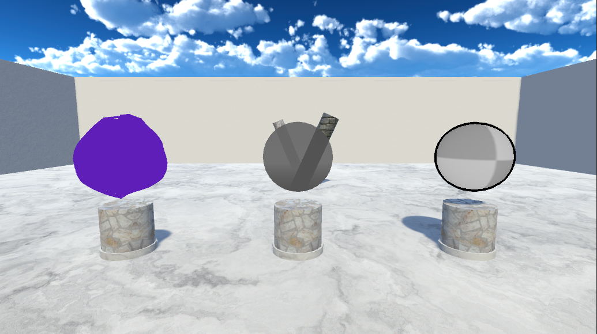
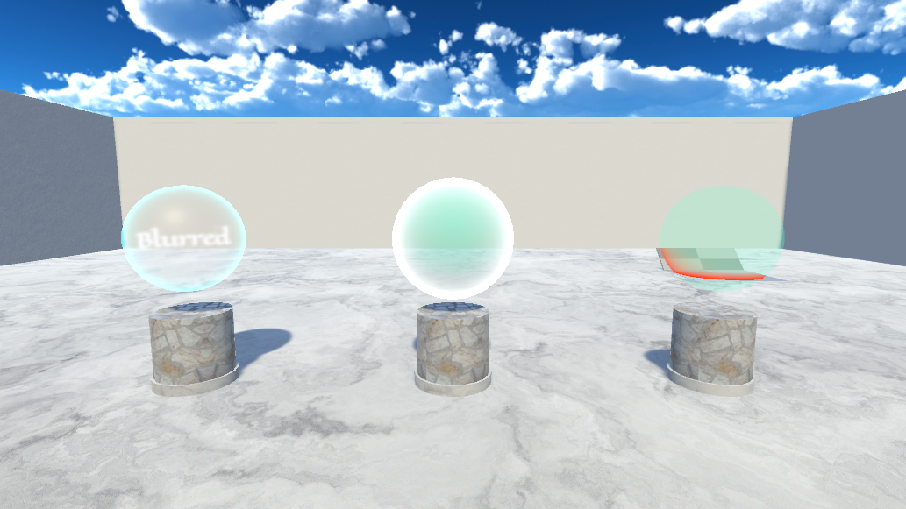
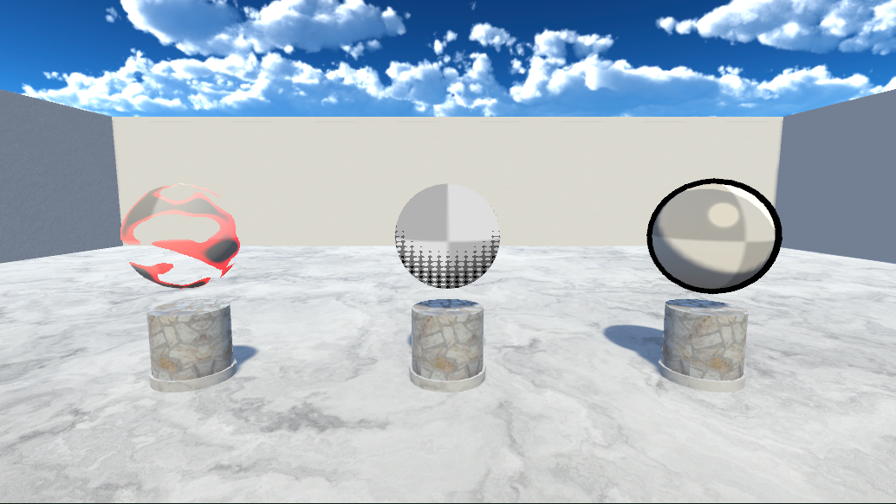

# Shader Showcase

## **A shader playground that you can edit and interact with in real-time. Made for the Academy of Interactive Entertainment.**

This shader showcase was made almost entirely without the Unity Shadergraph, instead only made using High Level Shader Language (HLSL) code. The one and only shader within the project that uses the shader graph is a world-aligned texture shader, as doing this within HLSL was too difficult for the time I had to work on this project.

 

Each shader below is ranked in order of difficulty with vertex manipulation being the easiest and cel-shading being the most complex / difficult to make. Every shader can be edited by the user within the shader showcase demo, ranging from the base color to the shader offsets.

### **Made With**
* C++
* HLSL
* Unity3D

---

## Demo 1
<video controls>
    <source src="./assets/intersect.mp4">
</video>

---

## Demo 2
<video controls>
    <source src="./assets/dissolve.mp4">
</video>

---

## Shader Level 1

Above is the three 'easy' shaders, from left to right, vertex manipulation, depth and sobel outline shader. Originally I started with manipulating vertex local positions within the vert shader, which was a firm starting block for other shaders. The depth shader was the next on the list, as it allowed me to learn how to access the depth buffer and display it locally on any mesh. The next step-up was to create a sobel shader, which is a popular edge detection algorithm, this is accomplished by doing a convolution with a horizontal and vertical kernel and multiplying the result with a color, in this case black.

---

## Shader Level 2

The next three 'medium' shaders, from left to right are, invisibility, forcefield and intersection shaders. The invisibility shader is a combination of a fresnel shader for the outline and a simple box blur to accomplish an effect somewhat similar to the invisibility in the 'Halo' franchise. The forcefield shader demonstrates a base color for the sphere mesh, and an extension to the vertex manipulation shader combined with another fresnel shader to achieve the exterior 'bubble' sphere. The intersection shader is the most complex of the three, as it uses the depth of the meshes to determine whether the shader is intersecting with the other mesh and color it accordingly.

---

## Shader Level 2

The last three are the 'hard' shaders, from left to right, dissolve, dot shading (aka stippling) and a cel-shader. The dissolution shader uses a base noise texture to determine where the shaders' opacity will be 0, this combined with coloring around the edges makes a fairly convincing dissolution effect. The dot shading uses a dot texture multiplied with step offsets to determine where the dots are drawn, and what color they are drawn with. The cel-shader is the most complex shader in this showcase using an outline shader for the thick black outline, and a separate cel-shading specific shader. The cel-shader works by figuring out where the shadow and highlights are and reducing the color range to achieve a stylized cel-shaded look.