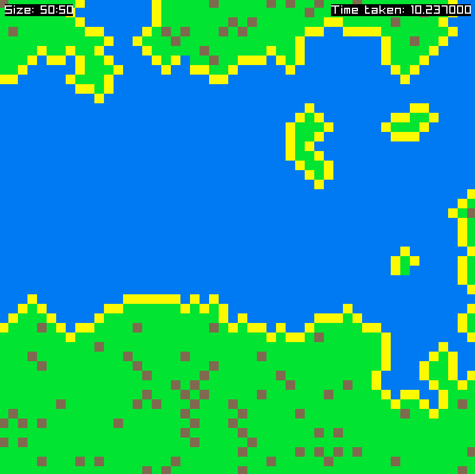
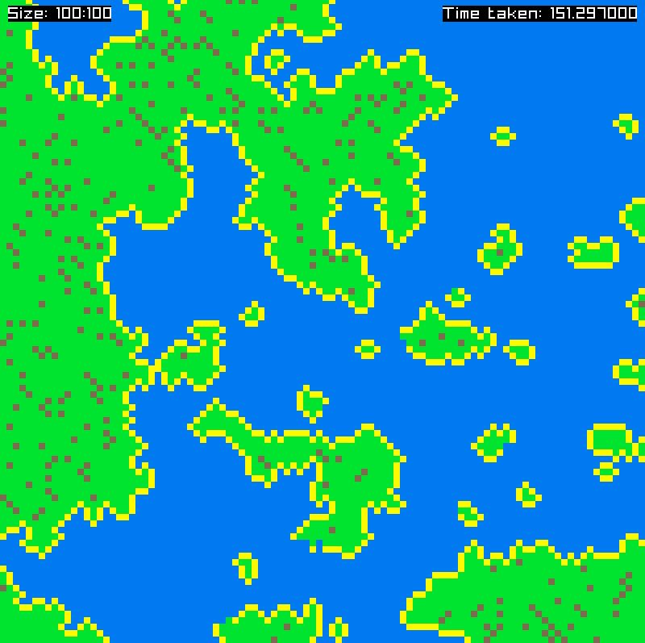
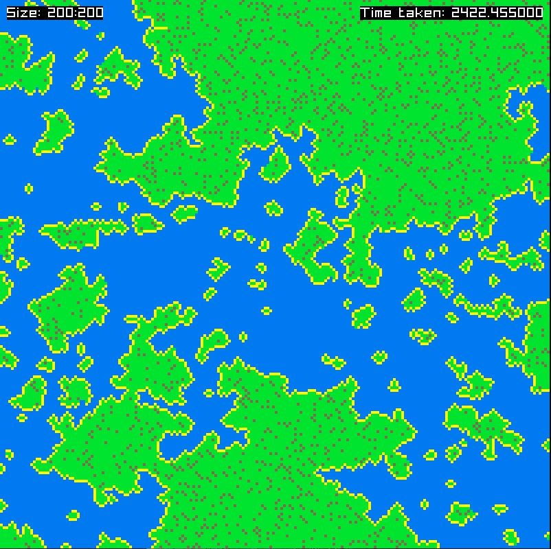

[HOME](../README.md)
|
[DEMO DOWNLOAD](https://github.com/E-Dawkins/ProjectDemos/releases/tag/Wave-Function-Collapse-Demo-v1.0)
# Wave Function Collapse

## **A simplified version of the wave function collapse algorithm, with additional tile-map clean up methods. Made as a personal side project.**

The 'Wave Function Collapse' algorithm works by storing possibilities for each tile, in my version for example there are 4 for each tile; water, sand, grass and trees, first a random tile is given a random type and then every tile around that one is collapsed, and around those ones, etc. The tile with the lowest possibilities is then chosen as the next start tile and it is given a random tile type, then the tiles around the new start tile are collapsed, etc. This is repeated until every tile is fully collapsed.

 

A tile is collapsed by checking its adjacent tiles against the adjacency rules, in my version for example; water can go next to itself and sand, sand can go next to water, itself and grass, grass can go next to sand and itself, and trees can only go next to grass and not itself. Any adjacent tiles that adhere to the adjacency rules are then added as the tiles new possibilities, thereby making it collapsed.

For a better explanation: https://youtu.be/20KHNA9jTsE

### **Made With**
* C++

---

## Demo

---

## 100 x 100

---

## 200 x 200
